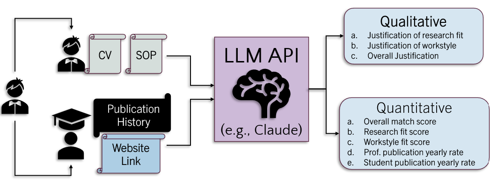

# PhinD me if You Can 🎓  
_Find your perfect PhD advisor match_

This repository contains a Streamlit prototype app that helps prospective PhD students explore how well they might match with a potential advisor, based on:

- Student’s research interests, skills, preferences, CV, and SOP  
- Professor’s Google Scholar and lab website  
- Precomputed LLM-based analyses stored as JSON files

The app is designed for the **Claude for Good 2025 – Student Track**.

---

## Features

### 🧑‍🎓 Student Profile Form
- Research interests  
- Statement of Purpose (SOP) upload (PDF)  
- CV / Resume upload  
- Professional / technical skills  
- Work–life balance preference  
- Preferred advising style  
➡️ **Required fields are marked with `*` and must be completed to proceed.**

### 👩‍🏫 Professor Profile Form
- Professor name  
- Affiliation (optional)  
- Google Scholar profile URL  
- Lab / personal website URL  
➡️ **Required fields are marked with `*`.**

### 📊 Match Evaluation (Results Page)
- Overall match score  
- Research fit, workstyle fit, and advising skill confidence  
- Professor publication rate (last few years)  
- Typical student publication output  
- Top target venues (conferences/journals)  
- Narrative explanations for research fit, workstyle, and overall recommendation  

Behind the scenes, the app uses **LLM APIs (such as Claude)** to perform match evaluation and generate detailed reasoning for the advisor–student compatibility.


---


## 1. Install Python

Make sure you have **Python 3.8 or higher** installed.

Check your Python version:

```bash
python3 --version
```

---

## 2. (Optional but recommended) Create a virtual environment

```bash
python3 -m venv venv
source venv/bin/activate
```

On Windows:

```powershell
python -m venv venv
venv\Scripts\Activate
```

---

## 3. Install required packages

Inside the project folder, run:

```bash
pip install streamlit pandas
```

These are the only required dependencies.

---

## 4. Run the Streamlit application

Run this from the same directory where `app.py` is located:

```bash
streamlit run app.py
```

Streamlit will start the app and display a link such as:

```
Local URL: http://localhost:8501
```

Open that link in your browser to use the app.

---

## 5. For background analysis, our prompt can be found here


```
https://docs.google.com/document/d/1LGRE-jqcXMxs-assE0VZHYdEmGx9yoFK5Ukv6mAB680/edit?usp=sharing
```
